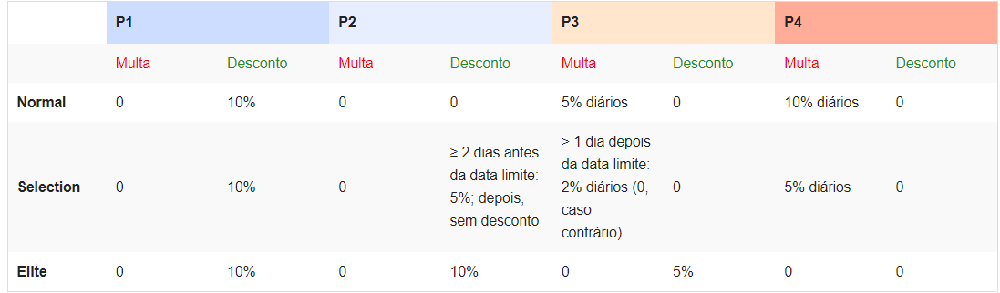

## Company Database

O objectivo do projecto é desenvolver uma aplicação de gestão para uma empresa de distribuição. A empresa concede prémios de fidelização aos bons clientes (baseando-se no volume de compras). A funcionalidade da aplicação inclui, entre outras acções: registar/manipular dados de produtos para venda, registar/manipular dados de clientes, registar/manipular dados de fornecedores de produtos para venda, registar/manipular transacções de venda e encomenda e fazer pesquisas várias sobre a informação armazenada.

Neste texto, o tipo negrito indica um literal (i.e., é exactamente como apresentado); o símbolo ␣ indica um espaço; e o tipo itálico indica uma parte variável.

### Empresa, Produtos, Clientes, Fornecedores e Transacções

Os produtos, clientes e fornecedores possuem uma chave única (cadeia de caracteres, não havendo distinção entre maiúsculas e minúsculas). As transacções (vendas e encomendas) possuem uma chave única inteira.

O saldo inicial da empresa é 0 (zero).

### Propriedades e Funcionalidade dos Produtos
Todos os produtos têm um fornecedor, um preço (um número inteiro positivo), um valor crı́tico (utilizado na gestão de existências) e o valor das existências.
A empresa vende caixas e contentores de vários tipos. Outros tipos de produtos diversos para venda são disponibilizados à empresa por fornecedores.
As caixas são produtos que têm um volume relativamente pequeno e servem para guardar um número relativamente pequeno de itens, por forma a protegê-los durante o seu transporte. As caixas têm um dado nível de serviço: normal, aéreo, expresso e em mão.
Os contentores são produtos que têm um volume muito maior que as caixas, permitindo guardar uma maior quantidade de itens. Têm os mesmos 4 níveis de serviço das caixas. Adicionalmente, os contentores têm 4 níveis de qualidade de serviço: B4, C4, C5, DL.
Cada livro é caracterizado pelo respectivo tı́tulo, autor e ISBN (cadeias de caracteres).
Poderão ser definidos novos tipos de produtos (e.g. discos ou CDs/DVDs), que terão propriedades específicas.

### Propriedades e Funcionalidade dos Clientes
Os clientes fazem compras que podem ser pagas mais tarde.
Cada cliente tem um nome (cadeia de caracteres) e uma morada (cadeia de caracteres). Associada a cada cliente existe ainda informação relativa às suas compras.

Um cliente tem ainda um estatuto (e.g., cliente "Elite" -- ver abaixo), o qual tem algum impacto na sua relação com a empresa.
Dado um cliente, é possível aceder ao historial das suas transacções.

### Propriedades e Funcionalidade dos Fornecedores
Os fornecedores respondem a encomendas por parte da empresa.

Cada fornecedor tem um nome (cadeia de caracteres) e uma morada (cadeia de caracteres).

Dado um fornecedor, é possı́vel aceder ao seu historial de transacções. É ainda possível activar/desactivar a realização de transacções com um fornecedor. Um fornecedor inactivo não pode realizar transacções.

### Propriedades e Funcionalidade das Transacções
Existem dois tipos de transacção: vendas e encomendas. As transacções são identificadas por um número (inteiro), atribuído de forma automática pela aplicação. Este identificador começa em 0 (zero), sendo incrementado quando se regista uma nova transacção. A sequência de identificadores é partilhada por todas as transacções (vendas e encomendas).

Uma encomenda está associada a um fornecedor e envolve uma ou mais unidades de um ou mais produtos fornecidos pelo fornecedor em causa. O custo unitário de cada produto corresponde ao custo do produto em causa. A encomenda guarda o seu custo total, para que futuras alterações no preço de um produto não alterem o valor que foi pago pela encomenda. Quando se faz uma encomenda deve considerar-se que a encomenda foi paga imediatamente e que as existências da empresa foram actualizadas considerando os produtos encomendados.

Uma venda envolve uma ou mais unidades de um único produto. Cada venda tem uma data limite de pagamento: primeiro realiza-se a venda e só depois é que se procede ao seu pagamento.

O preço a pagar por um cliente depende do tempo que demora a realizar o pagamento. São considerados os seguintes perı́odos (N é 5 para caixas, 8 para contentores e 3 para livros):

 - P1 - até N dias antes do limite de pagamento (data_limite_de_pagamento − data_actual ≥ N).
 - P2 - até à data limite (0 ≤ data_limite_de_pagamento − data_actual < N).
 - P3 - até N dias depois da data limite (0 < data_actual − data_limite_de_pagamento ≤ N).
 - P4 - após N dias depois da data limite (data_actual − data_limite_de_pagamento > N).

 Intervalos ao longo do tempo:

                        ──────────────┬──────────────┬──────────────┬──────────────
          >>> tempo >>>       P1      │      P2      │      P3      │      P4       >>> tempo >>>
                        ──────────────┴──────────────┴──────────────┴──────────────
                                    ↑              ↑              ↑      
                                prazo - N        prazo        prazo + N

### Notificações
Quando se regista um novo produto, os clientes devem ser colocados como entidades interessadas em receber notificações sobre eventos a ele associados. Em qualquer momento, um cliente pode activar ou desactivar as notificações relativas a um produto. Os eventos a considerar são os seguintes: (i) quando o produto passa de stock 0 (zero) para outro valor (positivo); (ii) quando um produto fica mais barato. As notificações são compostas pelo identificador do produto e pela descrição da notificação: NEW, para novas existências de produtos, mas não quando se regista um novo produto; e BARGAIN, para descidas de preços. As notificações são registadas nos clientes que as recebem.

A entrega de notificações deve ser flexível e prever vários meios de entrega, e.g., correio postal, SMS, email, entre outras. O meio de entrega por omissão corresponde a registar a notificação na aplicação.

### Contabilização de Pontos (Clientes)
As multas e os descontos aplicam-se apenas no pagamento de transacções de clientes (vendas).

Existem três classificações distintas de clientes: Nomal, Selection e Elite. A classificação de um cliente tem impacto nas multas, descontos e prazos de pagamento a aplicar no pagamento de uma transacção (venda).

Quando um cliente paga uma transacção dentro do prazo, acumula um número de pontos correspondente a 10 vezes o valor pago, se o pagamento for realizado dentro do prazo. Não há contabilização de pontos em pagamentos atrasados. A verificação do atraso é realizada quando se realiza o pagamento de uma transacção.

Os clientes passam ao nível Selection se acumularem mais de 2000 pontos. Os clientes passam ao nível Elite se acumularem mais de 25000 pontos.

Se um cliente se atrasa no pagamento da transacções, é despromovido: um cliente Elite passa a Selection se o pagamento ocorrer com um atraso de pagamento superior a 15 dias (perde 75% dos pontos acumulados); um cliente Selection passa a Normal se o pagamento ocorrer com um atraso de pagamento superior a 2 dias (perde 90% dos pontos acumulados).

As multas e os descontos dependem do estatuto do cliente e dos prazos associados à venda e ao estatuto.

### Data
A data é representada por um número inteiro e tem inicialmente o valor 0 (zero). A data pode começar com outro valor se se recuperar o estado da empresa a partir de um suporte persistente.

Os avanços de data são valores inteiros que representam o número de dias.

### Funcionalidade da aplicação
A aplicação permite manter informação sobre as entidades do modelo. Possui ainda a capacidade de preservar o seu estado (não é possível manter várias versões do estado da aplicação em simultâneo).

A base de dados com os conceitos pré-definidos é carregada no início da aplicação.

É possível saber os saldos da empresa (diferencial entre vendas e compras). Existe um saldo disponível, correspondente à diferença entre as vendas realmente pagas e as encomendas, e um saldo contabilístico, correspondente à diferença entre o valor contabilístico das vendas (pagas ou não e considerando descontos/penalizações à data da consulta de saldo) e as encomendas.

Deve ser possível efectuar pesquisas sujeitas a vários critérios e sobre as diferentes entidades geridas pela empresa.

### Serialização
É possível guardar e recuperar o estado actual da aplicação, preservando toda a informação relevante, descrita acima.

### Funcionalidade Associada a Entidades do Domínio
A seguinte funcionalidade sobre produtos deve ser suportada pela aplicação: (i) visualizar um produto; (ii) registar um novo produto; (iii) alterar o preço de um produto.

A seguinte funcionalidade sobre clientes deve ser suportada pela aplicação: (i) visualizar um ou mais clientes; (ii) registar um novo cliente; (iii) activar/desactivar notificações relativas a produtos; (iv) consultar o histórico de transacções realizadas por um cliente.

A seguinte funcionalidade sobre fornecedores deve ser suportada pela aplicação: (i) visualizar um fornecedor; (ii) registar um novo fornecedor; (iii) Permitir/inibir um fornecedor; (iv) consultar o histórico de transacções realizados.

A seguinte funcionalidade sobre transacções deve ser suportada: (i) visualizar uma transacção; (ii) registar uma nova venda; (iii) registar uma nova encomenda; (iv) pagar uma transacção.

### Requisitos de Desenho
Devem ser possíveis extensões ou alterações de funcionalidade com impacto mínimo no código já produzido para a aplicação. O objectivo é aumentar a flexibilidade da aplicação relativamente ao suporte de novas funções. Assim, deve ser possível:

- Adicionar novos tipos de produtos;
- Definir novas entidades que desejem ser notificadas da alteração do estado dos produtos;
- Adicionar novos modos de entrega de mensagens (notificações);
- Adicionar novas políticas de recompensa de clientes;
- Adicionar novas formas de consulta.
Embora na especificação actual não seja possível remover entidades, a inclusão desta funcionalidade deve ser prevista, por forma a minimizar o impacto da sua futura inclusão.

### Interacção com o utilizador
Descreve-se nesta secção a funcionalidade máxima da interface com o utilizador. Em geral, os comandos pedem toda a informação antes de procederem à sua validação (excepto onde indicado). Todos os menus têm automaticamente a opção Sair (fecha o menu).

As operações de pedido e apresentação de informação ao utilizador devem realizar-se através dos objectos form e display, respectivamente, presentes em cada comando. As mensagens são produzidas pelos métodos das bibliotecas de suporte (po-uuilib e woo-app). As mensagens não podem ser usadas no núcleo da aplicação (woo-core). Além disso, não podem ser definidas novas. Potenciais omissões devem ser esclarecidas antes de qualquer implementação.

As excepções usadas na interacção, excepto se indicado, são subclasses de pt.tecnico.po.ui.DialogException, são lançadas pelos comandos e tratadas por pt.tecnico.po.ui.Menu. Outras excepções não devem substituir as fornecidas nos casos descritos.

A apresentacção de listas (Fornecedores, Transacções, etc.) faz-se por ordem crescente da respectiva chave: dependendo dos casos, a ordem pode ser numérica ou lexicográfica (UTF-8), não havendo distinção entre maiúsculas e minúsculas.

